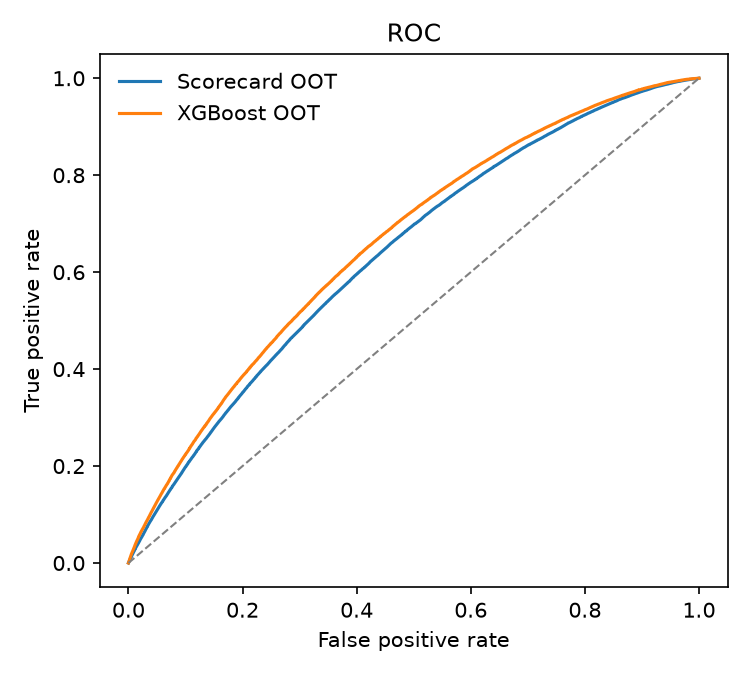
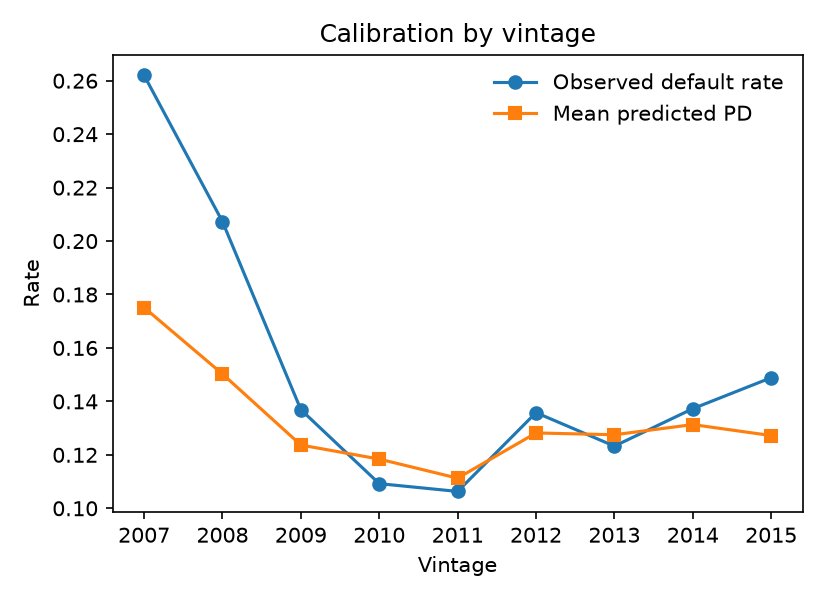

# Credit risk: PD scorecard, challenger and second-line validation

[](https://github.com/Rodgrandez/credit-risk-pd-validation/actions/workflows/ci.yml)

How would a bank's risk team build, challenge and validate a probability-of-default model? This project does it
end to end on 36-month Lending Club loans: a WoE logistic scorecard, an XGBoost challenger, an LGD model,
expected loss, and a validation report written as a second line of defence would write it.

<!-- RESULTS:START -->
<!-- RESULTS:END -->

 

**Reports:** [validation report (PDF)](reports/validation_report.pdf) · [model card](reports/model_card.md)

## Design choices
- Only resolved **36-month** loans. Development vintages 2007-2013 (80/20 split by loan id); **out-of-time 2014-2015**.
  Later vintages are still open at the 2018Q4 data cut-off and would bias the default rate upwards.
- Lending Club's grade and interest rate are **excluded** from the model and used only as a benchmark.
- Default = Charged Off / Default. LGD = 1 - net recoveries / exposure at default.

## Reproduce
```bash
conda env create -f environment.yml && conda activate credit-risk-pd
# Kaggle API token in ~/.kaggle/access_token (https://www.kaggle.com/settings/api)
make all        # or: python -m credit_risk.pipeline all
```

Data: [Lending Club loan data](https://www.kaggle.com/datasets/wordsforthewise/lending-club) (not redistributed here).
License: MIT.
